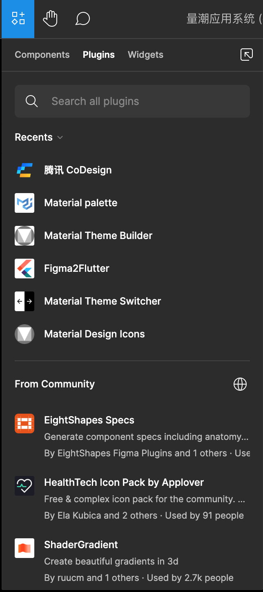

# 使用插件

计划以Material Design和Flutter为例。
假设设计语言选Material，开发框架选Flutter。
这样方便直接和这块社区融合，也是我们自己的选型。

1. 推荐Material Design常用插件、介绍使用方法。
2. 推荐Flutter常用插件、介绍使用方法。

## 安装插件

在搜索框搜索自己想要找的插件，比如“Material Design”。

（TODO：放图。）

从搜索结果中选择自己想要的插件，比如。

（TODO：放图。）
